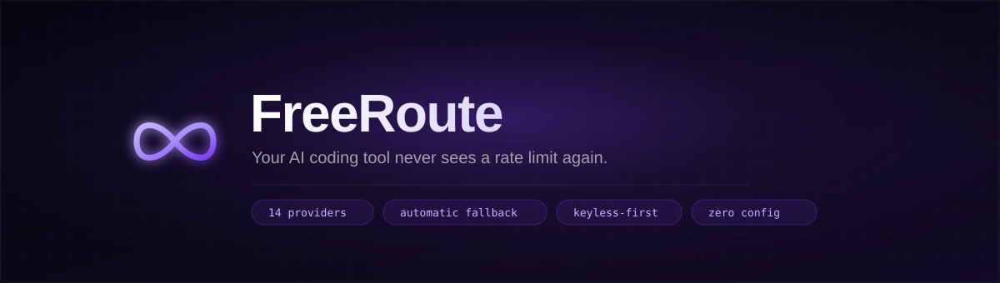
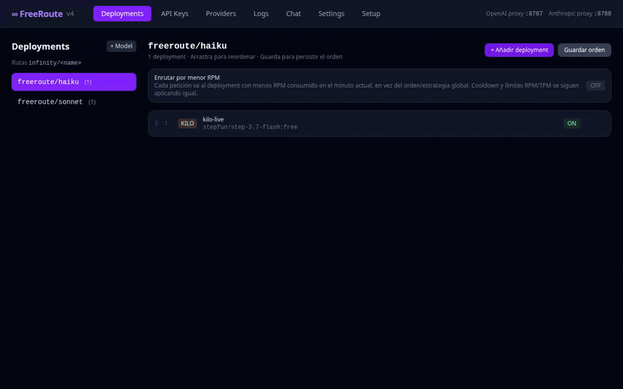
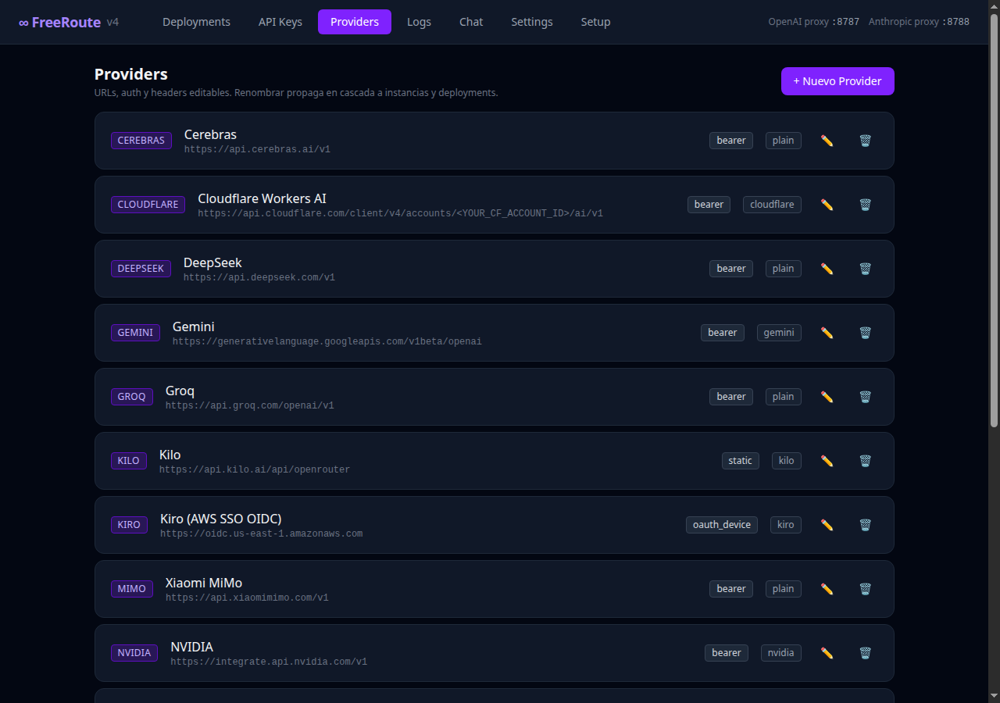
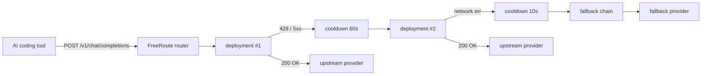

<div align="center">


A local proxy that sits in front of Claude Code, Cline, OpenCode, Aider and friends. When a
provider throttles you, degrades, or dies mid-stream, FreeRoute silently swaps in the next
deployment in your fallback chain — **same request, same session, zero interruption.**

[](LICENSE)
[](https://www.python.org/)
[](#tests)
[](CONTRIBUTING.md)

</div>

---

## 60 seconds, start to finish

Browse the three tiers Claude Code expects (`haiku` / `sonnet` / `opus`), send a real
streaming chat message, then check the request log — this is an unedited recording
against a live keyless provider (Kilo), no mocked data:

<div align="center">

<br><sub><b>Look at the Logs table at the end</b> — the same <code>freeroute/sonnet</code> deployment answers both
<code>:8787</code> (OpenAI-compatible <code>/v1/chat/completions</code>, used by the in-app Chat) and
<code>:8788</code> (Anthropic-compatible <code>/v1/messages</code>, Claude Code's wire protocol) from a single
router and a single set of deployments — no separate config, no separate keys.</sub>
</div>

---

## See it rescue a request

This is a real, unedited transcript. `freeroute/demo` had two deployments configured: a
deliberately broken one first, a working keyless one second. One `curl`, zero client-side
retry logic:

```bash
$ curl -s http://localhost:8787/v1/chat/completions \
    -H "Content-Type: application/json" \
    -d '{"model":"freeroute/demo","messages":[{"role":"user","content":"Reply with exactly one word: pong"}]}'

HTTP/1.1 200 OK
x-freeroute-provider: kilo
x-freeroute-model: nvidia/nemotron-3-nano-omni-30b-a3b-reasoning:free

{"choices":[{"message":{"content":"pong", ...}}], ...}
```

What actually happened, from `/api/logs`:

```
deployment #1  kilo · not-a-real-model-xyz            → 401 AUTH_ERROR   (415ms)
deployment #2  kilo · nvidia/nemotron-3-...:free       → 200 OK          (1017ms)
```

The client made **one** request and got **one** clean 200. FreeRoute ate the failure, put
deployment #1 in cooldown so it won't be retried for a while, and moved on — the same thing
happens with a real 429 from an exhausted free tier.

<div align="center">

<br><sub>All of this — providers, keys, fallback order — lives in SQLite and is edited from the UI. No YAML, no restart.</sub>
</div>

---

```
Claude Code · Cline · OpenCode · KiloCode · Aider · Roo Code · MiMo · Hermes
                              ↓
                   FreeRoute (localhost)
   :8787 → OpenAI-compatible  (/v1/chat/completions) + UI + REST API
   :8788 → Anthropic-compatible (/v1/messages)
                              ↓
        Router multi-provider · cooldown-aware · fallback chains
                              ↓
  OpenRouter · DeepSeek · Cerebras · SambaNova · Gemini · Groq · Z.AI · Kilo
     · Zen · NVIDIA · Ollama · Xiaomi MiMo · Cloudflare · Kiro (OAuth)
```

All configuration — providers, API keys, models, fallback chains — is **data-driven from
SQLite** and edited from the web UI at `http://localhost:8787`, not in code.

## Quick start

```bash
python3 -m venv .venv
.venv/bin/pip install -r requirements.txt
.venv/bin/python3 main.py
# → open http://localhost:8787 to add keys, providers and deployments
```

Then point any OpenAI-compatible client at the proxy:

| Setting | Value |
|---|---|
| Base URL | `http://localhost:8787/v1` |
| API key | any value (ignored) |
| Model | a `model_name` you created in Deployments, e.g. `infinity/sonnet` |

**Claude Code** uses the Anthropic proxy at `http://localhost:8788`. Ask for
`claude-opus-*`, `claude-sonnet-*` or `claude-haiku-*` and the proxy maps them to the
`opus` / `sonnet` / `haiku` tiers (each a `model_name` you configure).

## How routing works

Each `model_name` (e.g. `infinity/sonnet`) has several ordered **deployments**, each pointing
to a concrete provider + model. On every request the router:

1. Drops deployments that are in cooldown or over their RPM/TPM limit.
2. Picks one with the active **routing strategy** (`positional`, `simple-shuffle`,
   `latency-based`, `least-busy`).
3. On failure, puts the deployment in cooldown (duration depends on the error class) and
   tries the next one; when all are exhausted, it walks the configured **fallback chains**.

So if a model returns 503 or degrades, your session continues against the next deployment
with zero intervention.



## Why FreeRoute

There are LLM routers out there (LiteLLM being the obvious one). FreeRoute is opinionated
for a specific use case: **giving individual developers a free, resilient backend for their
AI coding tools**, not running a multi-tenant gateway.

- **Keyless-first.** Ships with Zen and Kilo pre-configured with no auth required — you can
  be productive before adding a single key.
- **Built for coding tools.** Both OpenAI and Anthropic wire protocols out of the box, so
  Claude Code works without a separate shim. Tool-call translation is handled for providers
  that mangle `index` fields (Gemini, Kiro).
- **Streaming that survives.** Mid-stream upstream failures trigger transparent recovery:
  the partial response is discarded, a fresh deployment is chosen and the stream resumes —
  the client never sees the disconnect. UTF-8 is decoded with an incremental decoder so
  multibyte boundaries across chunks don't corrupt emoji or CJK.
- **Everything is editable from the UI.** Providers, models, fallbacks, cooldowns, routing
  strategy and aliases live in SQLite. No YAML, no code edits, no restart to change a key.

## Supported providers

| Provider | Auth | Notes |
|---|---|---|
| OpenRouter | API key | Largest free-model catalog (`:free` suffix) |
| DeepSeek | API key | `deepseek-chat`, `deepseek-reasoner` |
| Cerebras | API key | Ultra-low-latency inference |
| SambaNova | API key | Generous free tier, Llama 3.1 405B |
| Gemini | API key | OpenAI-compatible endpoint |
| Groq | API key | Very fast Llama inference |
| Z.AI | API key | GLM models |
| Zen | keyless | OpenCode's free gateway, no auth header sent |
| Kilo | keyless | `Bearer anonymous`, OpenRouter-compatible |
| NVIDIA | API key | NIM endpoints |
| Ollama | local | Local models at `localhost:11434` |
| Xiaomi MiMo | API key | MiMo Code models |
| Cloudflare Workers AI | API key | Requires your account ID in the URL |
| Kiro | OAuth device | AWS SSO OIDC device flow |

See [`docs/providers.md`](docs/providers.md) for the full reference (URLs, free quotas,
where to get keys).

## Connecting your tools

The in-app **Setup** tab (`http://localhost:8787/setup`) gives copy-paste config snippets
for Claude Code, OpenCode, MiMo Code, Hermes, Roo Code and more. The short version:

**Claude Code** (`~/.claude/settings.json` or project settings):
```json
{
  "env": {
    "ANTHROPIC_BASE_URL": "http://127.0.0.1:8788",
    "ANTHROPIC_API_KEY": "freeroute"
  }
}
```

**Any OpenAI-compatible tool** — set base URL to `http://localhost:8787/v1`, any API key,
and a model name you configured in Deployments.

## Try it

```bash
# Health
curl -s http://localhost:8787/api/health | python3 -m json.tool

# OpenAI-compatible inference
curl -X POST http://localhost:8787/v1/chat/completions \
  -H "Content-Type: application/json" \
  -d '{"model":"infinity/sonnet","messages":[{"role":"user","content":"ping"}],"max_tokens":20}'

# Anthropic-compatible (Claude Code wire protocol)
curl -X POST http://localhost:8788/v1/messages \
  -H "Content-Type: application/json" -H "anthropic-version: 2023-06-01" \
  -d '{"model":"claude-sonnet-4-5","max_tokens":50,"messages":[{"role":"user","content":"ping"}]}'

# Router stats (latency p50/p95, active cooldowns)
curl -s http://localhost:8787/api/router-stats/latency | python3 -m json.tool
```

## Architecture

```
main.py            Entry point: launches two FastAPI apps in threads (8787 and 8788)
  routers/         One file per HTTP domain
    openai_proxy.py          POST /v1/chat/completions → Router (OpenAI passthrough)
    anthropic_proxy.py       POST /v1/messages → Anthropic↔OpenAI translation → Router
    api_keys.py              CRUD /api/instances (API keys per provider)
    providers.py             CRUD /api/providers (base_url, auth, kind, headers)
    deployments.py           CRUD /api/deployments (model_name → provider+model_id, ordered)
    router_settings.py       /api/router-settings (strategy, fallbacks, cooldowns, aliases)
    router_stats.py          /api/router-stats (p50/p95 latency, cooldowns, in-flight)
    logs.py / chains.py      /api/logs · chains → 410 Gone (deprecated)
  services/
    router.py                LiteLLM-style orchestrator: acompletion(model_name, body, stream)
    cooldown.py              Per-deployment cooldown, minute-bucketing, persisted to JSON
    routing_strategies.py    positional · simple-shuffle · latency-based · least-busy
    provider_handler.py      DataDrivenHandler: builds URL/headers/body per provider from DB
    translators.py           Anthropic↔OpenAI, including incremental SSE streaming
  db.py                      Async SQLite (aiosqlite): schema, migrations, CRUD helpers
  static/                    Compiled Svelte SPA · frontend/ is the source (Vite)
  tests/                     pytest suite (mocks upstreams — no network needed)
```

A request flows: proxy receives `model` → `router.acompletion()` resolves the `model_name`
(through optional `model_group_alias`), picks a healthy deployment, builds the upstream
request with the provider's `DataDrivenHandler`, fires it over HTTP/2 with streaming, and
classifies the result. On failure, the cooldown kicks in and the next deployment is tried.

See [`docs/architecture.md`](docs/architecture.md) for the full flow and design notes.

## Tests

```bash
.venv/bin/python3 -m pytest tests/ -q --ignore=tests/smoke_test.py    # unit suite
.venv/bin/ruff check services/ routers/ db.py main.py                  # lint
```

The unit suite (191 tests) mocks all upstreams and needs no network or running server.
`tests/smoke_test.py` is intentionally excluded — it hits a live `:8787`/`:8788` for manual
end-to-end checks and overhead measurement.

## Development

```bash
# Backend
.venv/bin/python3 main.py            # foreground, dev mode
setsid .venv/bin/python3 main.py > /tmp/freeroute.log 2>&1 &   # persistent background

# Frontend
cd frontend && npm install && npm run build   # recompiles the SPA into ../static
```

Env overrides (all optional, stable defaults):

| Var | Default | Purpose |
|---|---|---|
| `FREEROUTE_HOST` | `0.0.0.0` | Bind host |
| `FREEROUTE_PORT_OPENAI` | `8787` | OpenAI proxy + UI port |
| `FREEROUTE_PORT_ANTHROPIC` | `8788` | Anthropic proxy port |
| `FREEROUTE_DB_PATH` | `~/.freeroute.db` | SQLite database path |

## State on disk

```
~/.freeroute.db                         SQLite (providers, deployments, keys, settings, logs)
~/.freeroute-cooldowns.json  Persisted cooldown state (atomic rename)
.env                                    Your own API keys (NOT committed; code doesn't read it)
```

## Contributing

Issues and PRs welcome — see [`CONTRIBUTING.md`](CONTRIBUTING.md). Please open an issue
before large changes so we can align on direction.

## License

Apache-2.0. See [`LICENSE`](LICENSE).
