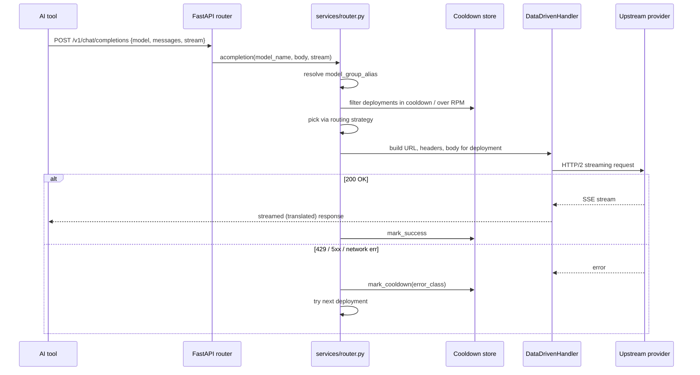

# Architecture

This document describes how FreeRoute is structured and how a request flows through it.
For the file-level map, see the README.

## Two FastAPI apps, two wire protocols

`main.py` launches two uvicorn servers in threads:

- **`openai_app` on `:8787`** — the OpenAI-compatible proxy (`POST /v1/chat/completions`,
  `GET /v1/models`), the REST API that the SPA consumes (`/api/*`), and the Svelte UI
  itself (served from `static/`).
- **`anthropic_app` on `:8788`** — the Anthropic-compatible proxy
  (`POST /v1/messages`) used by Claude Code. It translates Anthropic ↔ OpenAI on the way
  in and out so the same router core serves both.

Both apps share the same SQLite database, the same router instance and the same cooldown
state. Keeping them as separate apps (rather than two routes on one port) means each can
have its own CORS policy, lifespan and middleware without conditionals.

## The request flow

### Step by step

1. **Proxy receives the request.** The OpenAI proxy is a thin pass-through: it reads
   `model` from the body, hands `(model_name, body, stream)` to the router, and streams
   the chosen deployment's response back to the client (adding `X-Infinity-Provider` and
   `X-Infinity-Model` headers for debugging).

2. **Router resolves the model name.** `model_group_alias` (a setting) may rewrite the
   incoming `model` to a canonical `model_name` before lookup — this is how Claude Code's
   tiers (`opus`/`sonnet`/`haiku`) get remapped without code changes.

3. **Healthy-deployment selection.** The router fetches all enabled deployments with that
   `model_name`, then drops any that are currently in cooldown or over their RPM/TPM limit
   for the current minute bucket.

4. **Strategy picks one.** The active `routing_strategy` chooses among the survivors:
   - `positional` — first in `order`.
   - `simple-shuffle` — uniform random.
   - `latency-based` — weighted by recent p50 latency.
   - `least-busy` — fewest in-flight requests.

5. **Handler builds the upstream request.** The `DataDrivenHandler` for the deployment's
   provider constructs the URL (base_url + model_id suffix per provider convention),
   headers (auth, `HTTP-Referer` for OpenRouter, etc.) and the body, all from the
   `providers` and `api_instances` rows in SQLite — nothing is hardcoded.

6. **Fire and classify.** The request goes out over `httpx` with HTTP/2 and streaming. The
   result is classified as `success`, `rate_limited` (429), `server_error` (5xx) or
   `network_error`. Each class maps to a cooldown duration.

7. **On failure, retry.** The router marks the deployment in cooldown and tries the next
   one. When all deployments of this `model_name` are exhausted, it walks the configured
   fallback chains. Nothing left → `503` to the client.

## Cooldown and minute bucketing

`services/cooldown.py` is the resilience core. Key properties:

- **Per-deployment, not per-provider.** Two deployments of the same provider can have
  independent cooldown states, so one bad key doesn't poison the other.
- **Error-class-aware duration.** A 429 cools longer than a transient network blip.
  Configurable via `cooldown_times` in `router_settings`.
- **Minute-bucket RPM/TPM.** Counts are kept per 1-minute window so they naturally expire
  without a background sweeper.
- **Persisted.** Cooldown state is flushed to `~/.infinity-provisioner-cooldowns.json`
  via atomic rename, so a restart doesn't reset all deployments to "healthy" and hammer a
  provider that's still rate-limiting you.

## Streaming fault tolerance

`UpstreamStreamInterrupted` is the signal that a stream died mid-flight. When the router
catches it:

1. The partial bytes already sent to the client are discarded — the client must not see a
   truncated message.
2. A fresh, healthy deployment is selected (respecting cooldowns).
3. The request is replayed and the new stream is forwarded.

UTF-8 decoding uses `codecs.getincrementaldecoder("utf-8")` at every byte boundary (both
in `routers/openai_proxy.py` and in `services/translators.py`). Naive `bytes.decode()` per
chunk corrupts multibyte characters (emoji, CJK, accented Latin) when a chunk splits one.

## Data-driven configuration

Nothing about providers, models or fallbacks is hardcoded:

- **`providers`** — base_url, auth scheme, extra headers, parser `kind`.
- **`api_instances`** — one or more API keys per provider (rotated round-robin).
- **`deployments`** — `(model_name, provider, model_id, order)` tuples; a `model_name`
  resolves to an ordered list of these.
- **`router_settings`** — strategy, cooldown times, fallback chains, `model_group_alias`.

All editable from the SPA. Mutations call `app_router.invalidate_cache()` so the router
picks them up without a restart. This is why a new provider or key never requires a code
change — only a row in SQLite.

## Anthropic ↔ OpenAI translation

The Anthropic proxy (`:8788`) exists because Claude Code speaks Anthropic's wire protocol,
not OpenAI's. `services/translators.py` converts:

- **Request:** Anthropic `system` field → OpenAI `system` message; content blocks →
  string content; preserves `stream`, `max_tokens`, `temperature`, tool definitions.
- **Response (non-streaming):** OpenAI `choices[0].message` → Anthropic `content` blocks.
- **Response (streaming):** incremental SSE translation, including the `message_start` →
  `content_block_start` → `content_block_delta` → `message_stop` event sequence Claude
  Code expects, plus tool-use deltas with correct `index` assignment (Gemini and Kiro
  omit `index`; the translator falls back to positional enumeration).

## Why two threads, not two processes

The router and its cooldown state are in-process singletons. Sharing them across two
processes would require an IPC layer or external state store, which contradicts the
"single-binary, no external deps" goal. Threads + the GIL are fine here because the work
is I/O-bound (waiting on upstream HTTP), and `httpx`/`aiosqlite` release the GIL on every
await. Uvicorn's own thread runs the asyncio loop; the second app's loop runs in the
other thread.
